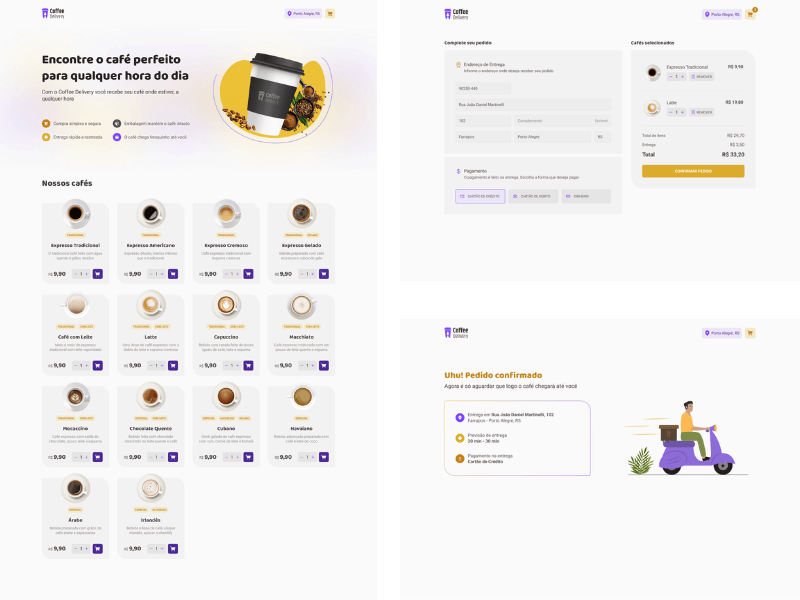

<h1 align="center">COFFEE</h1>

## Introdução

Coffee é uma aplicação WEB construída com Reactjs que simula uma loja de vendas de cafés.
No site do coffee o cliente seleciona o café e a quantidade desejada, acessa o carrinho, preenche os dados de entrega, o tipo de pagamente e finaliza o pedido. 

É um projeto de desafio para aplicar os conceitos sobre Reactjs abordados no módulo 2 do curso de Reactjs ignite 2022 ministrado pela Rocketseat.

<div align="center" >
  
</div>

## Requisitos

- Nodejs 16.20
- npm 8.19

## Tecnologias

- ReactJS
- Vite
- Typescript
- Style Components
- Context
- Reducers
- React Hook Forms
- Validação com ZOD
- Axios
- Json Server
- Phosphor React Icons
- Immer

## Instalação

```sh
# Fazer o clone do projeto em uma máquina local
git clone https://github.com/marciovz/coffee-reactjs-ignite2022.git
```

```sh
# Acessa a pasta do projeto
cd coffee-reactjs-ignite2022
```

```sh
# Rodar a instalação das dependências do projeto
npm install
```

## Rodando a aplicação

```sh
# Rodar o servidor json-server
npm run server

# Rodar a aplicação localmente
npm run dev
```

Abrir a aplicação no navegador no endereço http://localhost:3000


## Melhorias

- Aplicar testes
- Fazer o layout Responsivo
- Preenchimento automático do formuário

